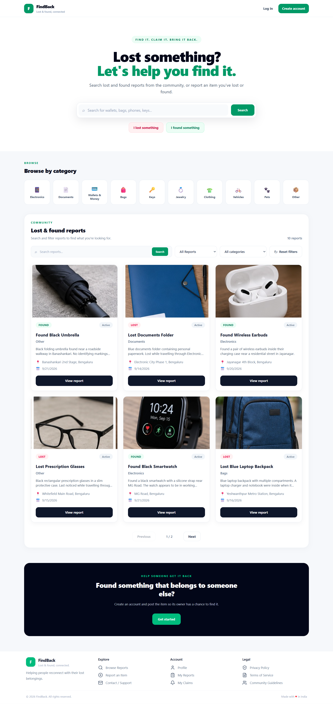
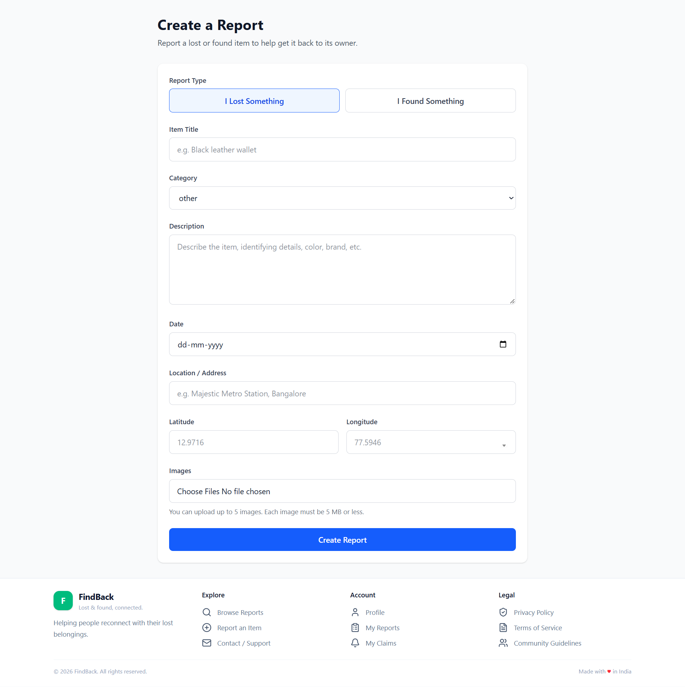
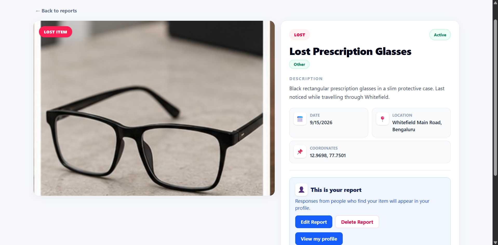
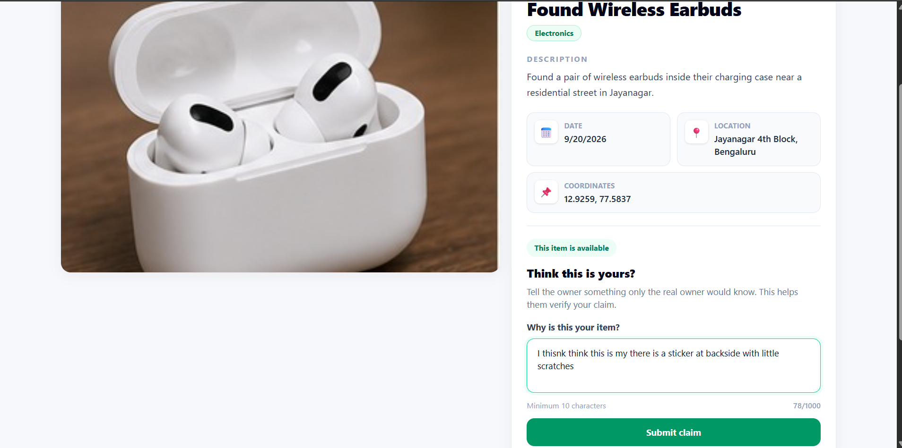
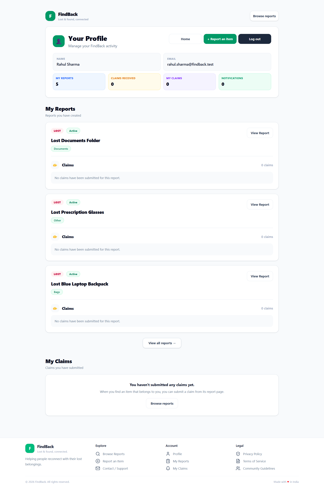

# FindBack

> A modern Lost & Found platform that helps people report, discover, claim, and return lost belongings.

FindBack is a full-stack Lost & Found web application built to solve a real-world problem: helping people reconnect with belongings they have lost.

Users can browse reports publicly, create Lost or Found reports, upload images, search and filter items, submit claims or found-item responses, receive notifications, and complete a two-sided handover process.

---

## Features

- 🔐 User registration and login
- 🔒 JWT authentication with HttpOnly cookies
- 📋 Create Lost and Found reports
- 🖼️ Multiple image uploads with Cloudinary
- 🔎 Search and filter reports
- 📍 Store item locations using GeoJSON
- ✏️ Edit and delete active reports
- 🤝 Ownership claim workflow for Found items
- 🔍 Found-item response workflow for Lost reports
- ✅ Claim and response approval/rejection
- 🔄 Two-sided handover confirmation
- 🔔 Claim, response, and handover notifications
- 👤 User profile and personal reports
- 📱 Responsive interface
- ⚖️ Privacy Policy, Terms of Service and Community Guidelines
- 📩 Contact / Support page

### Claim & Handover Workflow

```text
Found Item
    ↓
Submit Claim + Identifying Message
    ↓
Report Owner Reviews
    ↓
Approve / Reject
    ↓
Owner Hands Over Item
    ↓
Claimant Confirms Receipt
    ↓
Returned
```

### Lost Item Response Workflow

```text
Lost Item
    ↓
Finder Responds + Identifying Message
    ↓
Report Owner Reviews
    ↓
Approve / Reject
    ↓
Finder Hands Over Item
    ↓
Report Owner Confirms Receipt
    ↓
Returned
```

Items are marked as returned only after the required handover confirmations are completed.

---

## Screenshots

### Home / Browse Reports



### Create a Report



### Report Details — Lost Item



### Report Details — Found Item & Claim



### User Profile



---

## Tech Stack

### Frontend

- React
- Vite
- React Router
- Tailwind CSS
- Redux Toolkit
- Lucide React

### Backend

- Node.js
- Express.js
- JWT
- bcryptjs
- Mongoose
- Multer

### Database & Services

- MongoDB Atlas
- Cloudinary

### Tools

- Git & GitHub
- Postman
- Thunder Client

---

## Project Structure

```text
findback/
├── client/       # React frontend
├── server/       # Node.js + Express backend
├── screenshots/  # Project screenshots
├── package.json
└── README.md
```

---

## Upcoming Features

- 📍 Advanced location-based search
- 🤖 Smart item matching
- 🖼️ AI-powered image matching
- 💬 Real-time communication
- 📧 Email notifications
- 📱 Mobile application

---

## Author

### Adarsh

B.Tech — Information Technology

- GitHub: [https://github.com/adarsh-node](https://github.com/adarsh-node)
- LinkedIn: [https://www.linkedin.com/in/adarsh-techie/](https://www.linkedin.com/in/adarsh-techie/)
- Portfolio: [https://adarsh-techie.vercel.app/](https://adarsh-techie.vercel.app/)

---

## Project Status

🚧 **FindBack is actively under development.**

The core Lost & Found reporting, claim, response, notification, and handover workflows are implemented. More features and improvements are planned as the project evolves.
